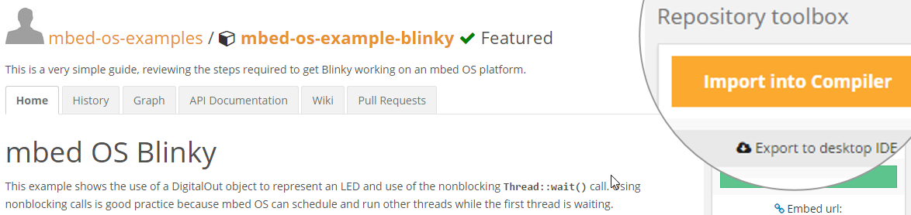

# Setup
{::options auto_ids="true" /}
{::options parse_block_html="true" /}

{: .card}

{: .card-block}

{: .card-title markdown="span"}
#### Create an mbed account

  Go to the [mbed developer site](https://developer.mbed.org) and [create an account](https://developer.mbed.org/account/signup/?next=%2F).
  {: .card-text}

{: .card}

{: .card-block}
  

{: .card-title markdown="span"}
#### How do you want to develop?

{: style="text-align: center;"}
  

{: .btn-group #online-or-offline role="group"}
  

  {::nomarkdown}
    <button class="btn btn-outline-primary" type="button" data-toggle="collapse" data-parent="#compile" data-target="#online-compile" aria-controls="online-compile">Online</button>
    <button class="btn btn-outline-primary" type="button" data-toggle="collapse" data-parent="#compile" data-target="#offline-compile" aria-controls="offline-compile">Offline</button>
  {:/}
  

{: #compile aria-multiselectable="true"}

{: .card}

{: #online-compile .collapse aria-labelledby="online"}

{: .card-block}

#### Get the code

  Visit the mbed-os [blinky example repository](https://developer.mbed.org/teams/mbed-os-examples/code/mbed-os-example-blinky/), and click the "Import into Compiler" button.
   
  {: .card-text}

* * *

#### Online 1b

  This is online 1b
  {: .card-text}

{: .card}

{: #offline-compile .collapse aria-labelledby="offline"}

{: .card-block}

#### Offline 1

  This is offline 1a
  {: .card-text}

{: .card}

{: .card-block}
  

{: .card-title markdown="span"}
#### More options

{: style="text-align: center;"}
  

{: .btn-group #stepX-selector role="group"}
  

  {::nomarkdown}
    <button class="btn btn-outline-primary" type="button" data-toggle="collapse" data-parent="#stepX" data-target="#stepX-option1" aria-controls="stepX-option1">Option 1</button>
    <button class="btn btn-outline-primary" type="button" data-toggle="collapse" data-parent="#stepX" data-target="#stepX-option2" aria-controls="stepX-option2">Option 2</button>
  {:/}
  

{: #stepX aria-multiselectable="true"}

{: .card}

{: #stepX-option1 .collapse aria-labelledby="option1"}

{: .card-block}

#### Option 1a

  This is option 1a
  {: .card-text}

* * *

#### Option 1b

  This is option 1b
  {: .card-text}

{: .card}

{: #stepX-option2 .collapse aria-labelledby="option2"}

{: .card-block}

#### Option 2a

  This is option 2a
  {: .card-text}

* * *

#### Option 2b

  This is option 2b
  {: .card-text}

